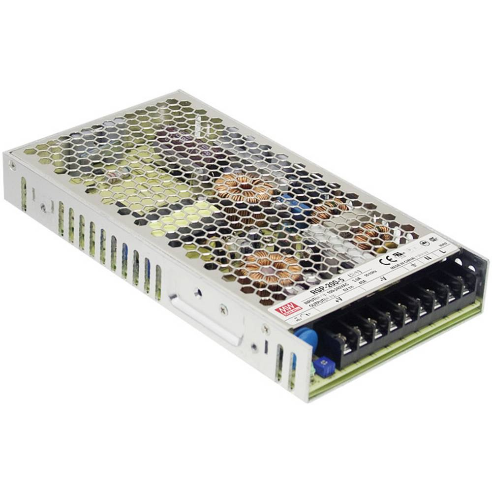

# Tinkerforge LED Wall
My private tinkerforge project living wall with 480 rgb pixel, 2x master bricks, 2x led strip bricklet, 1x segment display 4x7 bricklet, 1x linear poti bricket.

## Basic Requirements: Just LED Wall
- Power Supply: 5V >32A power adapter e.g.: Mean Well RSP-200-5 AC/DC-Netzteilbaustein, geschlossen 40 A 200 W 5 V/DC (53.48€)
- LED Controller: Tinkerforge Master Brick 2.1 (29,99€) + Tinkerforge LED Strip Bricklet v2.0 (12,99€)
- LED Lights: 17 * 28 = 476 RGB WS2811 LEDs eg.: China no name, just visit aliexpress and search for ws2811 led rgb IP68 (62,14€)

## Costs
Everything in total costs currently about 158,60€

## Hardware Requirements
### Power Supply Adapter
Mean Well RSP-200-5 AC/DC-Netzteilbaustein, geschlossen 40 A 200 W 5 V/DC

### Tinkerforge Master Brick 2.1:
https://www.tinkerforge.com/en/shop/bricks/master-brick.html

### Tinkerforge LED Strip Bricklet v2.0
https://www.tinkerforge.com/de/doc/Hardware/Bricklets/LED_Strip_V2.html

### LEDs  
https://de.aliexpress.com/wholesale?catId=0&initiative_id=SB_20200420171918&SearchText=ws2811+led+rgb+IP68

